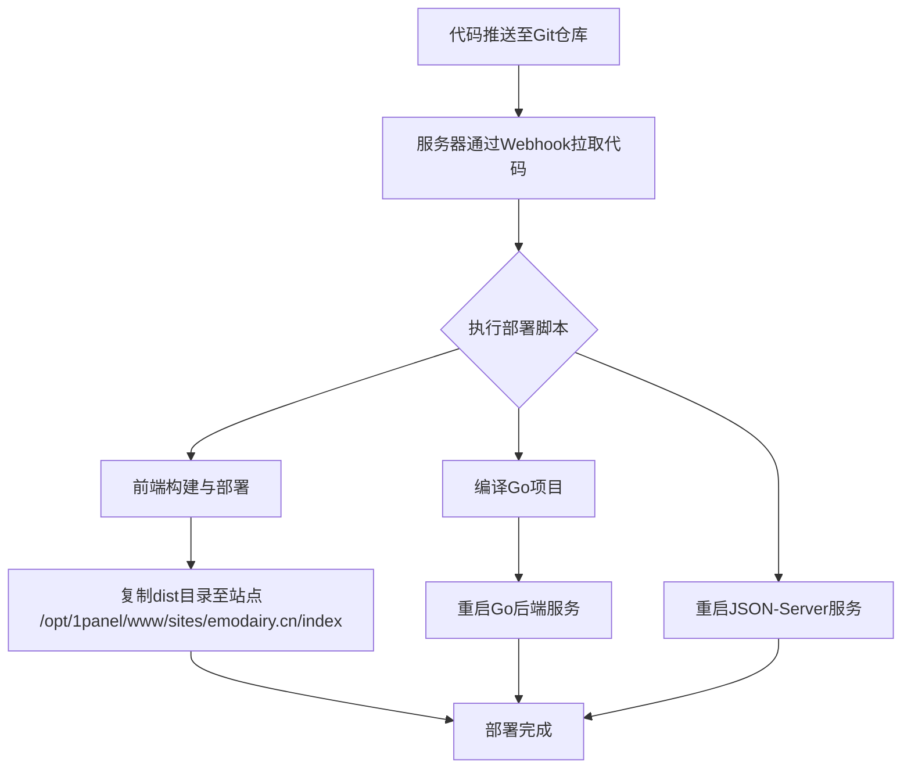

为你设计一个在1Panel环境下，集成Go后端、JSON-Server和前端，并能实现自动化部署的简单方案，其实可以分解为几个清晰的步骤。下面这个流程图概括了整体的部署与自动化思路，你可以先有个总览：



下面，我们就来详细说明每个环节的具体操作。

### 🛠️ 安装必要的服务与运行环境

首先，我们需要在1Panel中为你的各个服务配置运行环境。

1.  **安装 Go 运行环境**
    *   进入1Panel的「**应用商店**」。
    *   搜索 "**Go**"，选择安装。这会在容器内提供一个纯净的Go编译和运行环境。
    *   **关键配置**：建议将你的Go项目目录（例如 `/opt/1panel/apps/your_go_app`）**挂载**到Go应用容器的 `/app` 目录，方便容器内访问代码。

2.  **安装 Node.js 运行环境**
    *   同样在「**应用商店**」，搜索 "**Node.js**"并安装。它将用于运行 `json-server`。
    *   **关键配置**：将你的`json-server`项目目录（例如 `/opt/1panel/apps/your_mock_app`）挂载到Node.js应用容器的 `/app` 目录。

3.  **配置 OpenResty**
    你已安装OpenResty，现在需要配置它来**反向代理**你的前后端服务。
    *   进入1Panel的「**网站**」菜单，找到你的站点 `emodairy.cn`。
    *   在其设置或配置文件中，添加以下反向代理规则，将前端请求指向你的Go后端和JSON-Server：

    ```nginx
    # 位置： 网站 -> emodairy.cn -> 配置文件（或反向代理设置）
    # 将 /api/ 路径的请求代理到 Go 后端
    location /api/ {
        proxy_pass http://localhost:8080/;
        proxy_set_header Host $host;
        proxy_set_header X-Real-IP $remote_addr;
    }
    
    # 将 /mock/ 路径的请求代理到 json-server
    location /mock/ {
        proxy_pass http://localhost:3001/;
        proxy_set_header Host $host;
        proxy_set_header X-Real-IP $remote_addr;
        # 注意：重写URL，去掉 /mock 前缀，根据你的json-server路由配置可能需要
        rewrite ^/mock/(.*) /$1 break;
    }
    ```
    *   前端静态文件（位于 `/opt/1panel/www/sites/emodairy.cn/index`）已由OpenResty直接提供服务。

### 🔄 实现自动化部署

自动化部署的核心是让服务器在代码更新后，能自动拉取代码、构建并重启服务。我们将使用1Panel的**计划任务**配合一个**部署脚本**来实现。

1.  **创建统一的部署脚本**
    在服务器上创建一个脚本，例如 `deploy.sh`，并赋予执行权限 (`chmod +x deploy.sh`)。这个脚本将完成所有部署工作：

    ```bash
    #!/bin/bash
    set -e # 遇到错误立即退出
    
    echo "========== 开始部署 =========="
    
    # 1. 更新Go后端
    echo "步骤1: 部署Go后端..."
    cd /opt/1panel/apps/your_go_app
    git pull origin main
    # 在容器内编译Go项目，1Panel安装的Go应用容器名可能类似"1Panel-Go-xxx"
    docker exec 1Panel-Go-container-name go build -o your_go_app_main
    # 重启Go后端，方式取决于你的启动方式，例如：
    docker restart 1Panel-Go-container-name
    
    # 2. 更新JSON-Server (如果db.json或相关脚本有变动)
    echo "步骤2: 部署JSON-Server..."
    cd /opt/1panel/apps/your_mock_app
    git pull origin main
    # 重启JSON-Server，1Panel安装的Node.js应用容器名可能类似"1Panel-Nodejs-xxx"
    docker restart 1Panel-Nodejs-container-name
    
    # 3. 更新前端
    echo "步骤3: 部署前端..."
    cd /opt/1panel/apps/your_frontend_app
    git pull origin main
    npm install && npm run build
    # 清空并重新复制构建文件到网站目录
    rm -rf /opt/1panel/www/sites/emodairy.cn/index/*
    cp -r dist/* /opt/1panel/www/sites/emodairy.cn/index/
    
    echo "========== 部署完成！ =========="
    ```
    **注意**：请将脚本中的路径、容器名、分支名(`main`)等替换为你自己的实际信息。

2.  **配置 1Panel 计划任务与 Webhook**
    *   进入1Panel的「**计划任务**」。
    *   创建一个新的**Shell脚本**类型的任务。
    *   在任务内容中，填写你的部署脚本的绝对路径，例如 `/opt/1panel/apps/deploy.sh`。
    *   保存后，在这个任务的设置里，你应该能找到一个**Webhook URL**。复制这个URL地址。

3.  **在Git仓库中设置Webhook**
    以Gitee或GitHub为例，进入你的代码仓库设置：
    *   找到 **Webhooks** 设置项。
    *   **添加一个Webhook**：将上一步复制的URL粘贴到 `Payload URL`。
    *   **触发事件**：通常选择 `Push events`，这样在代码推送时就会触发。

完成以上所有设置后，你的自动化部署流水线就搭建完毕了。今后，你只需将代码推送到Git仓库的主分支，服务器就会自动完成所有部署工作。

### ⚠️ 注意事项

*   **路径与容器名**：确保脚本中的所有路径、1Panel应用容器名称都正确无误。你可以通过1Panel界面或 `docker ps` 命令查看准确的容器名。
*   **权限问题**：确保1Panel有权限访问和操作相关的目录与脚本。
*   **环境一致性**：确保本地开发与服务器上的环境（如Node.js版本、Go版本）一致，避免构建错误。
*   **先手动测试**：在设置自动化之前，先登录服务器手动执行一次 `deploy.sh` 脚本，确保每一步都能成功。

希望这份清晰的指南能帮助你顺利搭建起自动化部署流程！如果你在具体操作中遇到其他问题，随时可以再问我。